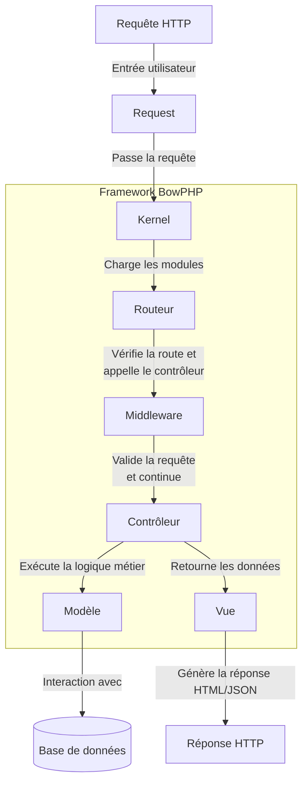

import SuggestionFeature from "@site/src/components/Partials/SuggestionFeature";

## Understanding the request lifecycle in BowPHP

BowPHP is a lightweight PHP framework designed to provide a clear, modular structure. When a request arrives, it follows a well-defined path called the **request lifecycle**. This cycle is organized to separate responsibilities, make the code easy to maintain, and improve performance.

### The request lifecycle explained

Every request goes through several steps before generating a response for the user.

Here are the main steps:

1. **HTTP request**: The user sends a request through their browser or an API.
2. **Request**: The framework captures this request and extracts the necessary data (URL, parameters, body, etc.).
3. **Kernel**: The Kernel is the heart of the framework. It:
  - Loads the configuration files located in the `config` folder (such as `config/database.php`).
  - Initializes the modules needed by the application.
4. **Application**: It starts the Kernel and prepares the environment to handle the request.
5. **Router**:
  - The router detects the route matching the request (for example, `/users/42` or `/api/login`).
  - It associates this route with a specific controller and method, defined directly in the route code.
  - If middlewares are defined for this route, they are executed before the controller is called.
6. **Middleware**: Middlewares perform specific processing, such as checking authentication or validating data.
7. **Controller**: Once the route is validated, the controller executes the business logic (for example, retrieving data or performing an action).
8. **Model**: If data is needed, the model interacts with the database to retrieve or update it.
9. **View**: The controller passes the retrieved data to the View component, which generates the final content (HTML, JSON, etc.).
10. **HTTP response**: The response is sent to the user.

### The router's role in detail

The router is a key component of BowPHP. It acts as a "compass" that directs each request to the right controller and the right method.

#### Route detection
The router examines the request URL and determines which route matches. Routes are defined in dedicated files (often routes/web.php or routes/api.php).

Example of a route definition:

```php
$app->get('/users/{id}', 'UserController@show');
$app->post('/api/login', 'AuthController@login');
```

:::note
Here:
The `GET /users/42` request is associated with the show method of the UserController controller.
The `POST /api/login` request is associated with the login method of the AuthController controller.
:::

#### Association with the controller

Once the route is detected, the router:

- Validates the URL parameters (such as `{id}`).
- Executes the middlewares defined for this route (if any).
- Calls the controller and method associated with the route.

### A modular architecture

BowPHP is built on a modular architecture. Each module is independent, has its own configuration, and fulfills a specific role. This makes the application easy to manage and extend. The router is one example of this modular approach. Another example is the Database module, which manages database connections.

#### Example: The Database module

Let's take the case of the **Database** module, which manages database connections:

**Configuration file: `config/database.php`**

This file contains the parameters needed to connect to the database. Here is a simple example:

```php title="config/database.php"
return [
    'default' => 'mysql',
    'connections' => [
        'mysql' => [
            'driver' => 'mysql',
            'host' => '127.0.0.1',
            'port' => 3306,
            'database' => 'bowphp_app',
            'username' => 'root',
            'password' => '',
            'charset' => 'utf8mb4',
            'collation' => 'utf8mb4_unicode_ci',
        ],
    ],
];
```

#### **The `Bow\Database\DatabaseConfiguration` class**
This class is responsible for reading the parameters from the `config/database.php` file and establishing a connection to the database.

#### **The Kernel's role**
At startup, the Kernel loads the `config/database.php` file using `DatabaseConfiguration` defined in `app/Kernel.php` and initializes a database connection, ready to be used by other components.

### Visualization with a diagram

Here is a visual representation to better understand the request lifecycle and modular integration (example with **Database**):
Loads the configurations

Here is an updated diagram highlighting the role of the router and the modular integration (example with Database)


```mermaid
graph TB
    A[Requête HTTP] -->|Entrée utilisateur| B[Request]
    B -->|Passe la requête| C[Kernel]
    C -->|Charge les modules| D[Routeur]
    D -->|Vérifie la route et<br>appelle le contrôleur| E[Middleware]
    E -->|Valide la requête<br>et continue| F[Contrôleur]
    F -->|Exécute la logique métier| G[Modèle]
    G -->|Interaction avec| H[(Base de données)]
    F -->|Retourne les données| I[Vue]
    I -->|Génère la réponse HTML/JSON| J[Réponse HTTP]

    subgraph Framework BowPHP
        C
        D
        E
        F
        G
        I
    end
```

### Summary of the key points

- **Structured lifecycle**: A request follows a precise path (Request → Kernel → Router → Middleware → Controller → Model → View → Response).
- **The router's role**: The router detects the route matching the request and calls the associated controller and method.
- **Kernel**: Orchestrates the loading of configurations from the config folder and initializes the modules.
- **Modularity**: Each component (router, database, etc.) is independent, which simplifies management and improves maintainability.

## Contributing

Thank you for considering contributing to BowPHP! The contribution guide can be found in the documentation.

- [Franck DAKIA](https://github.com/papac)
- [Thanks to the contributors](https://github.com/bowphp/app/graphs/contributors)

<SuggestionFeature />
