import SuggestionFeature from "@site/src/components/Partials/SuggestionFeature";

## Comprendre le cycle de vie d'une requête dans BowPHP

BowPHP est un framework PHP léger, conçu pour offrir une structure claire et modulaire. Lorsqu'une requête arrive, elle suit un chemin bien défini appelé **cycle de vie d'une requête**. Ce cycle est organisé pour séparer les responsabilités, rendre le code facile à maintenir et améliorer les performances.

### Le cycle de vie d'une requête expliqué

Chaque requête passe par plusieurs étapes avant de générer une réponse pour l'utilisateur.

Voici les étapes principales :

1. **Requête HTTP** : L'utilisateur envoie une requête via son navigateur ou une API.
2. **Request** : Le framework capture cette requête et extrait les données nécessaires (URL, paramètres, corps, etc.).
3. **Kernel** : Le Kernel est le cœur du framework. Il :
  - Charge les fichiers de configuration situés dans le dossier `config` (comme `config/database.php`).
  - Initialise les modules nécessaires à l'application.
4. **Application** : Elle démarre le Kernel et prépare l'environnement pour traiter la requête.
5. **Routeur** :
  - Le routeur détecte la route correspondant à la requête (par exemple, `/users/42` ou `/api/login`).
  - Il associe cette route à un contrôleur et une méthode spécifique, définis directement dans le code des routes.
  - Si des middlewares sont définis pour cette route, ils sont exécutés avant d'appeler le contrôleur.
6. **Middleware** : Les middlewares effectuent des traitements spécifiques, comme vérifier l'authentification ou valider les données.
7. **Contrôleur** : Une fois la route validée, le contrôleur exécute la logique métier (par exemple, récupérer des données ou effectuer une action).
8. **Modèle** : Si des données sont nécessaires, le modèle interagit avec la base de données pour les récupérer ou les mettre à jour.
9. **Vue** : Le contrôleur renvoie les données récupérées au composant Vue, qui génère le contenu final (HTML, JSON, etc.).
10. **Réponse HTTP** : La réponse est envoyée à l'utilisateur.

### Le rôle du routeur en détail

Le routeur est un composant clé de BowPHP. Il agit comme une "boussole" qui oriente chaque requête vers le bon contrôleur et la bonne méthode.

#### Détection de la route
Le routeur examine l'URL de la requête et détermine quelle route correspond. Les routes sont définies dans des fichiers dédiés (souvent routes/web.php ou routes/api.php).

Exemple de définition de route :

```php
$app->get('/users/{id}', 'UserController@show');
$app->post('/api/login', 'AuthController@login');
```

:::note
Ici :
La requête `GET /users/42` est associée à la méthode show du contrôleur UserController.
La requête `POST /api/login` est associée à la méthode login du contrôleur AuthController.
:::

#### Association au contrôleur

Une fois la route détectée, le routeur :

- Valide les paramètres de l'URL (comme `{id}`).
- Exécute les middlewares définis pour cette route (s'il y en a).
- Appelle le contrôleur et la méthode associés à la route.

### Une architecture modulaire

BowPHP repose sur une architecture modulaire. Chaque module est indépendant, possédant sa propre configuration et remplit un rôle spécifique. Cela rend l'application facile à gérer et à étendre. Le routeur est un exemple de cette approche modulaire. Un autre exemple est le module Database, qui gère les connexions à la base de données.

#### Exemple : Le module Database

Prenons le cas du module **Database**, qui gère les connexions à la base de données :

**Fichier de configuration : `config/database.php`**

Ce fichier contient les paramètres nécessaires pour se connecter à la base de données. Voici un exemple simple :

```php title="config/database.php"
return [
    'default' => 'mysql',
    'connections' => [
        'mysql' => [
            'driver' => 'mysql',
            'host' => '127.0.0.1',
            'port' => 3306,
            'database' => 'bowphp_app',
            'username' => 'root',
            'password' => '',
            'charset' => 'utf8mb4',
            'collation' => 'utf8mb4_unicode_ci',
        ],
    ],
];
```

#### **Classe `Bow\Database\DatabaseConfiguration`**
Cette classe est chargée de lire les paramètres du fichier `config/database.php` et d'établir une connexion à la base de données.

#### **Rôle du Kernel**
Au démarrage, le Kernel charge le fichier `config/database.php` à l'aide de `DatabaseConfiguration` défini dans `app/Kernel.php` et initialise une connexion à la base de données, prête à être utilisée par d'autres composants.

### Visualisation avec un diagramme

Voici une représentation visuelle pour mieux comprendre le cycle de vie d'une requête et l'intégration modulaire (exemple avec **Database**) :
Charge les configurations

Voici un diagramme mis à jour, mettant en évidence le rôle du routeur et l'intégration modulaire (exemple avec Database)

```mermaid
graph TB
    A[Requête HTTP] -->|Entrée utilisateur| B[Request]
    B -->|Passe la requête| C[Kernel]
    C -->|Charge les modules| D[Routeur]
    D -->|Vérifie la route et<br>appelle le contrôleur| E[Middleware]
    E -->|Valide la requête<br>et continue| F[Contrôleur]
    F -->|Exécute la logique métier| G[Modèle]
    G -->|Interaction avec| H[(Base de données)]
    F -->|Retourne les données| I[Vue]
    I -->|Génère la réponse HTML/JSON| J[Réponse HTTP]

    subgraph Framework BowPHP
        C
        D
        E
        F
        G
        I
    end
```



### Résumé des points importants

- **Cycle de vie structuré** : Une requête suit un chemin précis (Request → Kernel → Routeur → Middleware → Contrôleur → Modèle → Vue → Réponse).
- **Rôle du routeur** : Le routeur détecte la route correspondant à la requête et appelle le contrôleur et la méthode associés.
- **Kernel** : Orchestre le chargement des configurations depuis le dossier config et initialise les modules.
- **Modularité** : Chaque composant (routeur, base de données, etc.) est indépendant, ce qui simplifie la gestion et améliore la maintenabilité.

## Contributing

Merci d'avoir envisagé de contribuer à Bow Framework ! Le guide de contribution se trouve dans la documentation.

- [Franck DAKIA](https://github.com/papac)
- [Merci aux collaborateurs](https://github.com/bowphp/app/graphs/contributors)

<SuggestionFeature />
